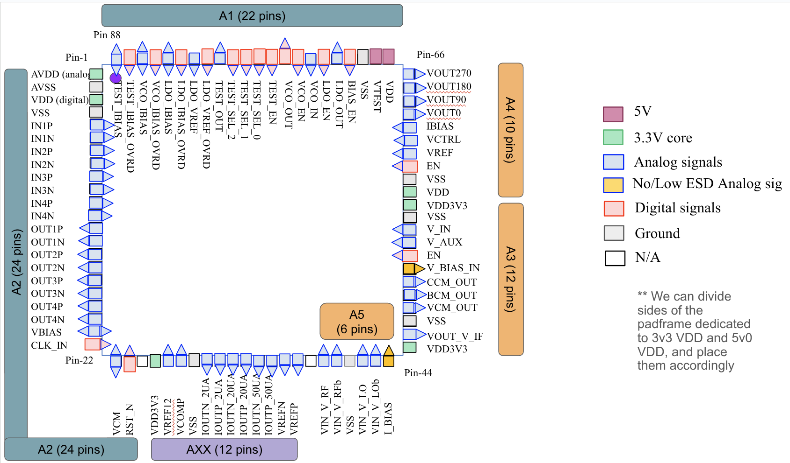

# Padframe Pinlist

:point_right: also [here](https://docs.google.com/spreadsheets/d/1y95F5xRDPT4PPcBqw_M6BF-6ktROtTYHMTWsu83tv68/edit?gid=0#gid=0) and chip-pin vis [here](https://docs.google.com/presentation/d/1NSJSQ3wVLxsyclua6tIB7L30JWD02e-ac7chGh-z9tY/edit?usp=sharing)

|   Number | Name            | Type     | Direction     | Team owner           | Suggested ESD/IO pad     | IO config                                            |
|---------:|:----------------|:---------|:--------------|:---------------------|:-------------------------|:-----------------------------------------------------|
|        1 | AVDD (analog)   | 3V Power | Bidirectional | A2 Gen YZ            | gf180mcu_fd_io__dvdd     | nan                                                  |
|        2 | AVSS            | Ground   | Bidirectional | A2 Gen YZ            | gf180mcu_fd_io__dvss     | nan                                                  |
|        3 | VDD (digital)   | 3V Power | Bidirectional | A2 Gen YZ            | gf180mcu_fd_io__dvdd     | nan                                                  |
|        4 | VSS             | Ground   | Bidirectional | A2 Gen YZ            | gf180mcu_fd_io__dvss     | nan                                                  |
|        5 | IN1P            | Analog   | Input         | A2 Gen YZ            | gf180mcu_fd_io__asig_5p0 | nan                                                  |
|        6 | IN1N            | Analog   | Input         | A2 Gen YZ            | gf180mcu_fd_io__asig_5p0 | nan                                                  |
|        7 | IN2P            | Analog   | Input         | A2 Gen YZ            | gf180mcu_fd_io__asig_5p0 | nan                                                  |
|        8 | IN2N            | Analog   | Input         | A2 Gen YZ            | gf180mcu_fd_io__asig_5p0 | nan                                                  |
|        9 | IN3P            | Analog   | Input         | A2 Gen YZ            | gf180mcu_fd_io__asig_5p0 | nan                                                  |
|       10 | IN3N            | Analog   | Input         | A2 Gen YZ            | gf180mcu_fd_io__asig_5p0 | nan                                                  |
|       11 | IN4P            | Analog   | Input         | A2 Gen YZ            | gf180mcu_fd_io__asig_5p0 | nan                                                  |
|       12 | IN4N            | Analog   | Input         | A2 Gen YZ            | gf180mcu_fd_io__asig_5p0 | nan                                                  |
|       13 | OUT1P           | Analog   | Output        | A2 Gen YZ            | gf180mcu_fd_io__asig_5p0 | nan                                                  |
|       14 | OUT1N           | Analog   | Output        | A2 Gen YZ            | gf180mcu_fd_io__asig_5p0 | nan                                                  |
|       15 | OUT2P           | Analog   | Output        | A2 Gen YZ            | gf180mcu_fd_io__asig_5p0 | nan                                                  |
|       16 | OUT2N           | Analog   | Output        | A2 Gen YZ            | gf180mcu_fd_io__asig_5p0 | nan                                                  |
|       17 | OUT3P           | Analog   | Output        | A2 Gen YZ            | gf180mcu_fd_io__asig_5p0 | nan                                                  |
|       18 | OUT3N           | Analog   | Output        | A2 Gen YZ            | gf180mcu_fd_io__asig_5p0 | nan                                                  |
|       19 | OUT4P           | Analog   | Output        | A2 Gen YZ            | gf180mcu_fd_io__asig_5p0 | nan                                                  |
|       20 | OUT4N           | Analog   | Output        | A2 Gen YZ            | gf180mcu_fd_io__asig_5p0 | nan                                                  |
|       21 | VBIAS           | Analog   | Bidirectional | A2 Gen YZ            | gf180mcu_fd_io__asig_5p0 | nan                                                  |
|       22 | CLK_IN          | Digital  | Input         | A2 Gen YZ            | gf180mcu_fd_io__in_c     | PU=0, PD=0                                           |
|       23 | VCM             | Analog   | Bidirectional | A2 Gen YZ            | gf180mcu_fd_io__asig_5p0 | nan                                                  |
|       24 | RST_N           | Digital  | Input         | A2 Gen YZ            | gf180mcu_fd_io__in_c     | PU=0, PD=1                                           |
|       25 | nan             | nan      | nan           | nan                  | nan                      | nan                                                  |
|       26 | VDD3V3          | 3V Power | Bidirectional | AXX Onchip           | gf180mcu_fd_io__dvdd     | nan                                                  |
|       27 | VREF12          | Analog   | Input         | AXX Onchip           | gf180mcu_fd_io__asig_5p0 | nan                                                  |
|       28 | VCOMP           | Analog   | Input         | AXX Onchip           | gf180mcu_fd_io__asig_5p0 | nan                                                  |
|       29 | VSS             | Ground   | Bidirectional | AXX Onchip           | gf180mcu_fd_io__dvss     | nan                                                  |
|       30 | IOUTN_2UA       | Analog   | Output        | AXX Onchip           | gf180mcu_fd_io__asig_5p0 | nan                                                  |
|       31 | IOUTP_2UA       | Analog   | Output        | AXX Onchip           | gf180mcu_fd_io__asig_5p0 | nan                                                  |
|       32 | IOUTN_20UA      | Analog   | Output        | AXX Onchip           | gf180mcu_fd_io__asig_5p0 | nan                                                  |
|       33 | IOUTP_20UA      | Analog   | Output        | AXX Onchip           | gf180mcu_fd_io__asig_5p0 | nan                                                  |
|       34 | IOUTN_50UA      | Analog   | Output        | AXX Onchip           | gf180mcu_fd_io__asig_5p0 | nan                                                  |
|       35 | IOUTP_50UA      | Analog   | Output        | AXX Onchip           | gf180mcu_fd_io__asig_5p0 | nan                                                  |
|       36 | VREFN           | Analog   | Output        | AXX Onchip           | gf180mcu_fd_io__asig_5p0 | nan                                                  |
|       37 | VREFP           | Analog   | Output        | AXX Onchip           | gf180mcu_fd_io__asig_5p0 | nan                                                  |
|       38 | nan             | nan      | nan           | nan                  | nan                      | nan                                                  |
|       39 | VIN_V_LO        | Analog   | Input         | A5 Time Transcenders | gf180mcu_fd_io__asig_5p0 | nan                                                  |
|       40 | VIN_V_RF        | Analog   | Input         | A5 Time Transcenders | gf180mcu_fd_io__asig_5p0 | nan                                                  |
|       41 | VSS             | Ground   | Bidirectional | A5 Time Transcenders | gf180mcu_fd_io__dvss     | nan                                                  |
|       42 | VIN_V_RFb       | Analog   | Input         | A5 Time Transcenders | gf180mcu_fd_io__asig_5p0 | nan                                                  |
|       43 | VIN_V_LOb       | Analog   | Input         | A5 Time Transcenders | gf180mcu_fd_io__asig_5p0 | nan                                                  |
|       44 | I_BIAS          | Analog   | Input         | A5 Time Transcenders | gf180mcu_fd_io__asig_5p0 | nan                                                  |
|       45 | VDD3V3          | 3V Power | Bidirectional | A5 Time Transcenders | gf180mcu_fd_io__dvdd     | nan                                                  |
|       46 | VOUT_V_IF       | Analog   | Output        | A5 Time Transcenders | gf180mcu_fd_io__asig_5p0 | nan                                                  |
|       47 | VSS             | Ground   | Bidirectional | A3 Mahowalders       | gf180mcu_fd_io__dvss     | nan                                                  |
|       48 | VCM_OUT         | Analog   | Output        | A3 Mahowalders       | gf180mcu_fd_io__asig_5p0 | nan                                                  |
|       49 | BCM_OUT         | Analog   | Output        | A3 Mahowalders       | gf180mcu_fd_io__asig_5p0 | nan                                                  |
|       50 | CCM_OUT         | Analog   | Output        | A3 Mahowalders       | gf180mcu_fd_io__asig_5p0 | nan                                                  |
|       51 | V_BIAS_IN       | Analog   | Output        | A3 Mahowalders       | gf180mcu_fd_io__asig_5p0 | nan                                                  |
|       52 | EN              | Digital  | Input         | A3 Mahowalders       | gf180mcu_fd_io__in_c     | PU=0, PD=1                                           |
|       53 | V_AUX           | Analog   | Input         | A3 Mahowalders       | gf180mcu_fd_io__asig_5p0 | nan                                                  |
|       54 | V_IN            | Analog   | Input         | A3 Mahowalders       | gf180mcu_fd_io__asig_5p0 | nan                                                  |
|       55 | VSS             | Ground   | Bidirectional | A3 Mahowalders       | gf180mcu_fd_io__dvss     | nan                                                  |
|       56 | VDD_3v3         | 3V Power | Bidirectional | A3 Mahowalders       | gf180mcu_fd_io__dvdd     | nan                                                  |
|       57 | VDD             | 3V Power | Bidirectional | A4  Silicon Souls    | gf180mcu_fd_io__dvdd     | nan                                                  |
|       58 | VSS             | Ground   | Bidirectional | A4  Silicon Souls    | gf180mcu_fd_io__dvss     | nan                                                  |
|       59 | EN              | Digital  | Input         | A4  Silicon Souls    | gf180mcu_fd_io__in_c     | PU=0, PD=1                                           |
|       60 | VREF            | Analog   | Input         | A4  Silicon Souls    | gf180mcu_fd_io__asig_5p0 | nan                                                  |
|       61 | VCTRL           | Analog   | Input         | A4  Silicon Souls    | gf180mcu_fd_io__asig_5p0 | nan                                                  |
|       62 | IBIAS           | Analog   | Input         | A4  Silicon Souls    | gf180mcu_fd_io__asig_5p0 | nan                                                  |
|       63 | VOUT0           | Analog   | Output        | A4  Silicon Souls    | gf180mcu_fd_io__asig_5p0 | nan                                                  |
|       64 | VOUT90          | Analog   | Output        | A4  Silicon Souls    | gf180mcu_fd_io__asig_5p0 | nan                                                  |
|       65 | VOUT180         | Analog   | Output        | A4  Silicon Souls    | gf180mcu_fd_io__asig_5p0 | nan                                                  |
|       66 | VOUT270         | Analog   | Output        | A4  Silicon Souls    | gf180mcu_fd_io__asig_5p0 | nan                                                  |
|       67 | VDD             | 5V Power | Bidirectional | A1 AutoMOS           | gf180mcu_fd_io__dvdd     | nan                                                  |
|       68 | VTEST           | 5V Power | Bidirectional | A1 AutoMOS           | gf180mcu_fd_io__dvdd     | nan                                                  |
|       69 | VSS             | Ground   | Bidirectional | A1 AutoMOS           | gf180mcu_fd_io__dvss     | nan                                                  |
|       70 | BIAS_EN         | Digital  | Input         | A1 AutoMOS           | gf180mcu_fd_io__in_c     | PU=0, PD=1                                           |
|       71 | LDO_OUT         | Analog   | Output        | A1 AutoMOS           | gf180mcu_fd_io__dvdd     | nan                                                  |
|       72 | LDO_EN          | Digital  | Input         | A1 AutoMOS           | gf180mcu_fd_io__in_c     | PU=0, PD=1                                           |
|       73 | VCO_IN          | Analog   | Input         | A1 AutoMOS           | gf180mcu_fd_io__asig_5p0 | nan                                                  |
|       74 | VCO_EN          | Digital  | Input         | A1 AutoMOS           | gf180mcu_fd_io__in_c     | PU=0, PD=1                                           |
|       75 | VCO_OUT         | Digital  | Output        | A1 AutoMOS           | gf180mcu_fd_io__bi_t     | PU=0, PD=1, IE=0, CS=0, OE=1, PDVR0=0, PDRV1=0, SL=0 |
|       76 | TEST_EN         | Digital  | Input         | A1 AutoMOS           | gf180mcu_fd_io__in_c     | PU=0, PD=1                                           |
|       77 | TEST_SEL_0      | Digital  | Input         | A1 AutoMOS           | gf180mcu_fd_io__in_c     | PU=0, PD=1                                           |
|       78 | TEST_SEL_1      | Digital  | Input         | A1 AutoMOS           | gf180mcu_fd_io__in_c     | PU=0, PD=1                                           |
|       79 | TEST_SEL_2      | Digital  | Input         | A1 AutoMOS           | gf180mcu_fd_io__in_c     | PU=0, PD=1                                           |
|       80 | TEST_OUT        | Analog   | Output        | A1 AutoMOS           | gf180mcu_fd_io__asig_5p0 | nan                                                  |
|       81 | LDO_VREF_OVRD   | Digital  | Input         | A1 AutoMOS           | gf180mcu_fd_io__in_c     | PU=0, PD=1                                           |
|       82 | LDO_VREF        | Analog   | Input         | A1 AutoMOS           | gf180mcu_fd_io__asig_5p0 | nan                                                  |
|       83 | LDO_IBIAS_OVRD  | Digital  | Input         | A1 AutoMOS           | gf180mcu_fd_io__in_c     | PU=0, PD=1                                           |
|       84 | LDO_IBIAS       | Analog   | Bidirectional | A1 AutoMOS           | gf180mcu_fd_io__asig_5p0 | nan                                                  |
|       85 | VCO_IBIAS_OVRD  | Digital  | Input         | A1 AutoMOS           | gf180mcu_fd_io__in_c     | PU=0, PD=1                                           |
|       86 | VCO_IBIAS       | Analog   | Bidirectional | A1 AutoMOS           | gf180mcu_fd_io__asig_5p0 | nan                                                  |
|       87 | TEST_IBIAS_OVRD | Digital  | Input         | A1 AutoMOS           | gf180mcu_fd_io__in_c     | PU=0, PD=1                                           |
|       88 | TEST_IBIAS      | Analog   | Bidirectional | A1 AutoMOS           | gf180mcu_fd_io__asig_5p0 | nan                                                  |

